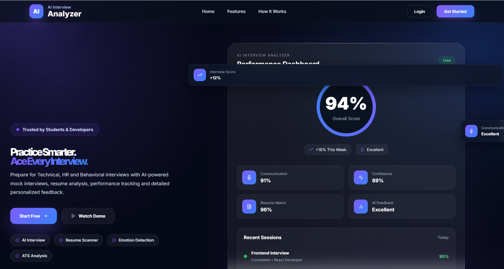
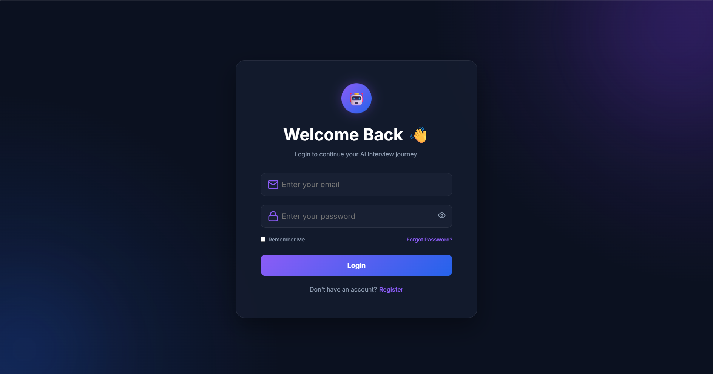
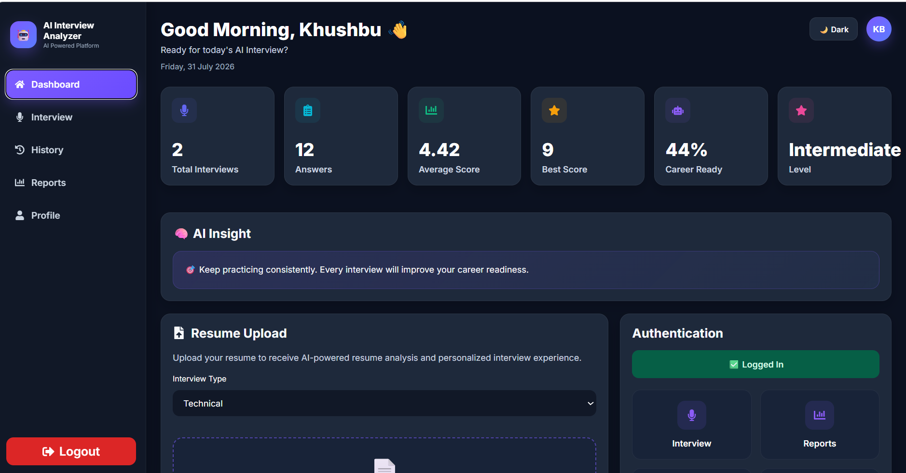
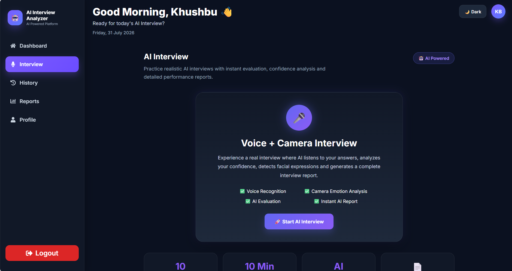
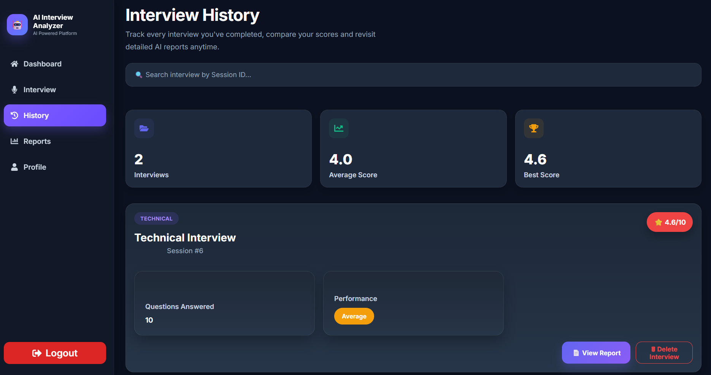

# 🤖 AI Interview Analyzer Pro

> **AI-powered Full Stack Mock Interview Platform** that helps candidates prepare for technical interviews through intelligent resume analysis, personalized interview generation, AI-based answer evaluation, emotion detection, and detailed performance reports.

---

## 🌐 Live Demo

🚀 **Live Website:**  
https://ai-interview-analyzer-pro.vercel.app

---

## 🚀 Features

### 🔐 Authentication
- User Registration & Login
- JWT-based Authentication
- Protected Routes
- Secure API Access

### 📄 Resume Analysis
- Upload Resume (PDF)
- AI Resume Analysis using Google Gemini
- Skill Extraction
- Personalized Interview Question Generation

### 🎤 AI Mock Interview
- AI-generated Interview Questions
- Speech-to-Text (Voice Input)
- 60-second Timer for Each Question
- Live Camera Feed
- Real-time Emotion Detection using Face-api.js

### 📊 AI Evaluation
- AI-based Answer Evaluation
- Technical Score
- Communication Score
- Confidence Assessment
- Personalized Feedback
- Hiring Recommendation

### 📑 Reports & Analytics
- Interview Summary
- PDF Report Generation
- Learning Roadmap
- Emotion Analysis
- Performance Statistics
- Best Score & Average Score

### 📈 Dashboard
- Total Interviews
- Total Answers
- Average Score
- Best Score
- Interview History
- Progress Tracking

---

# 📸 Project Screenshots

## 🏠 Home Page



---

## 🔐 Login Page



---

## 📊 Dashboard



---

## 🎤 AI Interview



---

## 📜 Interview History



---

## 🛠 Tech Stack

### Frontend
- React.js
- Vite
- React Router
- Axios
- CSS

### Backend
- FastAPI
- Python
- SQLAlchemy
- JWT Authentication

### Database
- PostgreSQL (Neon)

### AI & Machine Learning
- Google Gemini API
- Face-api.js
- Web Speech API

---

# 📂 Project Structure

```
AI-Interview-Analyzer-Pro
│
├── backend
│   ├── app
│   │   ├── api
│   │   ├── database
│   │   ├── models
│   │   ├── schemas
│   │   ├── services
│   │   └── utils
│   ├── requirements.txt
│   └── main.py
│
├── frontend
│   ├── public
│   ├── src
│   │   ├── assets
│   │   ├── components
│   │   ├── pages
│   │   └── api.js
│   └── package.json
│
├── screenshots
│
└── README.md
```

---

# ⚙️ Installation

## Clone Repository

```bash
git clone https://github.com/khushbu12121/AI-Interview-Analyzer-Pro.git

cd AI-Interview-Analyzer-Pro
```

---

## Backend Setup

```bash
cd backend

python -m venv venv

# Windows
venv\Scripts\activate

# Linux/Mac
source venv/bin/activate

pip install -r requirements.txt

uvicorn main:app --reload
```

---

## Frontend Setup

```bash
cd frontend

npm install

npm run dev
```

---

# 🔑 Environment Variables

Create a `.env` file inside the **backend** folder.

```env
DATABASE_URL=YOUR_NEON_DATABASE_URL

SECRET_KEY=YOUR_SECRET_KEY

ALGORITHM=HS256

ACCESS_TOKEN_EXPIRE_HOURS=24

GEMINI_API_KEY=YOUR_GEMINI_API_KEY
```

---

# 🎯 Future Improvements

- AI Follow-up Questions
- ATS Resume Score
- Docker Support
- CI/CD Pipeline
- Interview Replay
- Performance Graphs
- Google Login
- Company-wise Interview Modes

---

# 👩‍💻 Author

**Khushbu Bansal**

🎓 B.Tech Computer Science Engineering

💻 Full Stack Developer | AI Enthusiast

GitHub: https://github.com/khushbu12121

---

# ⭐ Project Status

✅ **Production Ready**

---

# 💡 Why AI Interview Analyzer Pro?

AI Interview Analyzer Pro provides an end-to-end interview preparation experience by combining **AI-powered resume analysis**, **personalized interview question generation**, **speech recognition**, **emotion detection**, and **detailed performance evaluation**. It helps candidates identify strengths, improve weak areas, and build confidence for real technical interviews.

---

## 🌟 If you found this project useful, don't forget to ⭐ star the repository!
